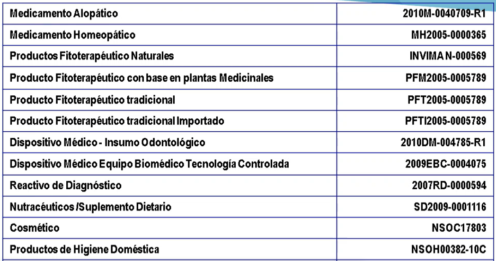
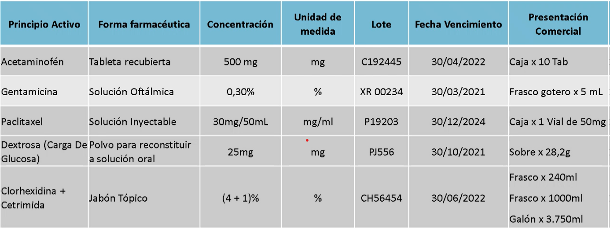
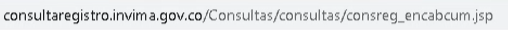
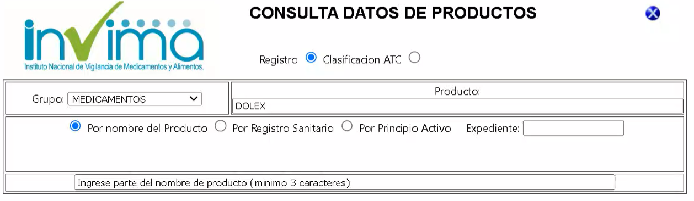
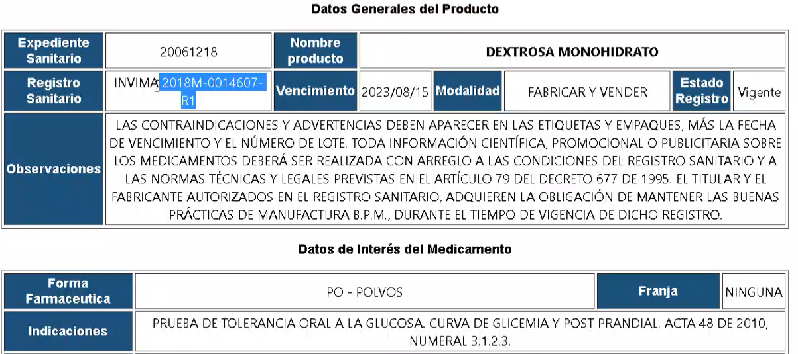
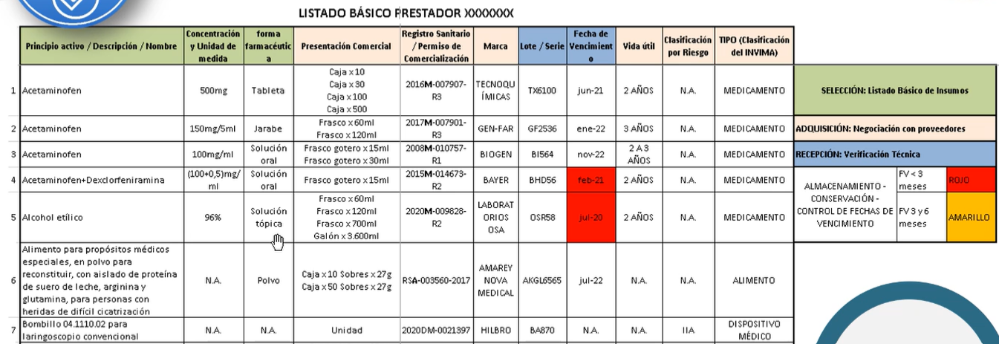
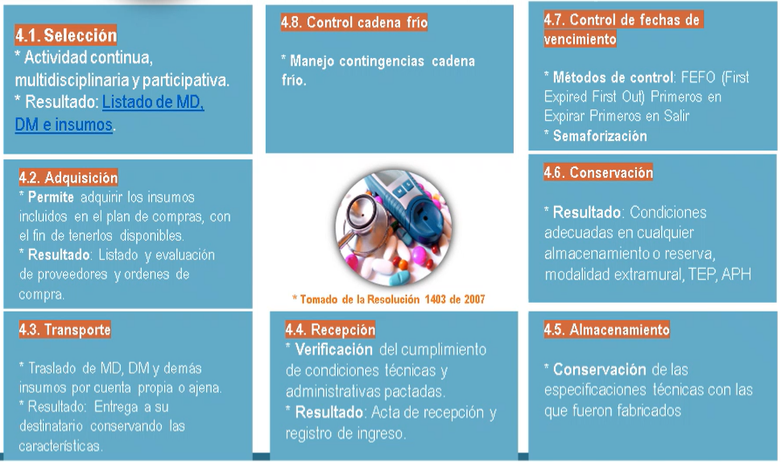
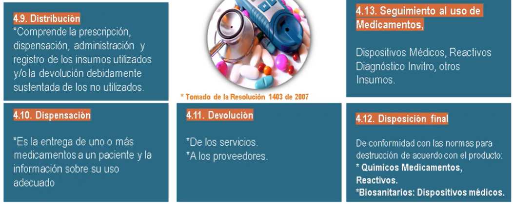

 
# Estandar 4 **Medicamentos**

El estandar esta compuesto por varios Criterios a seguir sin embargo no todos aplican a todos los prestadores o instituciónes. Hay criterios creados para instituciónes mas grandes sin embargo, el profesional independiente debe adaptarse y diseñar sus propios documentos según el tamaño de la instutición. 

- Contar con listados que contengan la información del Dispositivo Medicos y Medicamentos según corresponda. Cada producto requiere de una descripción tecnica. 

#### Notas Genrales

1. Listado basico de Registro de DM & M e Incluso Instrumental.

2. Respecto a los galores o envases estos no se deben reembasar por lo cual es aconsejable usar bolsas u otros desechables. 
3. Todos los productos que usamos deben estar en español. 
4. La fichas tecnicas deben ser del fabricante no del importador. 
5. Odontología no requiere Kid de quemaduras por agentes Quimicos. 
6. Los estandares a veces se realaciónan entre si por lo tanto su documnetación tambien lo debe hacer, es decir no deben haber discrepancias cuando el tema a tratar es el mismo según criterios establecidos en cada Estandar. 
7. Los odontologos que prescriben Antibioticos deben tener un documento donde se describe como el profesional garantiza la seguridad del paciente a traves de la prescripción. 
8. Gatrantizar el no reuso de dispositivos medicos cuando el fabricante asi lo establezca. 
9. Solo Hospitalización y Urgencias requieren Kid contra violencia Sexual. 
10. Las tomas de temperatura deberian estar definidas en intervalos de 8 horas diarias. 
11. No es aceptable que los contenedores docificados con detergentes o Alcoholes esten sucios, lo mejor es no usar docificadores. 

#### Busqueda de Medicamentos en Registro Sanitario 

1. Ingresar el siguiente enlace para búscar Medicamentos o Dispositivos Medicos. Solo sirven aquellos productos en estado **Vigente** y por el contrario se deben descartar estados en **Vencido, Perdida de Fuerza Ejecutoria, Cancelado**. La busqueda de los productos se realiza con los digitos numericos del Registro Sanitario. 2013RD**0002673**-R1 Donde **R1** quiere decir que fue renovado lo cual implica actualizar todos los datos del Registro. 

2. Para Ingresar la descrición tecnica del producto se debe hacer click en **Expediente Sanitario**

3. Ejemplo de Listado Obligatorio de una Prestador de Salud. El cambio de un producto implica un registro nuevo. A este tipo de listados se suelen llamar Kardex de Inventario. Si tenemos productos que ya no estan en uso entonces se deben sacar de la lista. Esta lista puede tener el registro de cada una de las piezas instrumentales del Consultorio. 

   

# Información Documentada de Proceso

El profesional independiente debe establecer su listado y definir cuando lo va a actualizar. La información documentada de Procesos es un requisito del Estandar 4 o de **Medicamentos** y toda esta información se explica claramente en la **Resolución 1403 - 2007**. Tener claro cuales son los metodos de Disposicion de Productos. La semaforización del Producto que la establece el Prestador(En el Documento de Concervación de Fechas de Vencimiento). En la Ditribución hay que entender de que se trata la Distribución y Dispensación. La disposición Final debe ir ligada a lo que esta Expuesto en el PGHIR y Seguridad Paciente. 

# Condiciones de Dispositivos Medicos

Humedad entre 40% y 70%. Temperatura 15°C y 30°C.  

# Información Documentada
- **Medicamentos** - Decreto 780 de 2016 - Resolución 1403 de 2007 Farmacovigilancia
- **Dispositivos Medicos** - Drecreto 4725 de 2005 Tecnovigilancia.

### **Manejo de Rupturas y derrames de Medicamentos** 
Proceso de derrames y Rupturas, Control de Fechas de Vencimiento del Kid. El Kid no tiene que estar obligatoriamente dentro del ambiente monitoreado por el Termihigrometro. Debe haber un Kid para manejo de derrame de Fluidos(Recipiente Rigido en caso de Vidrios) y Otro para Manejo de derrame de Medicamentos(Basico- Toalla Bolas.)

**Notas** Las diapositivas serán enviadas al correo Junto con la Hoja de Calculo con el formato de Kadex de Inventario.
  
